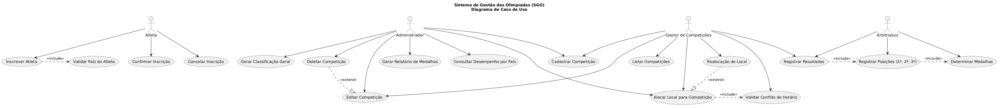
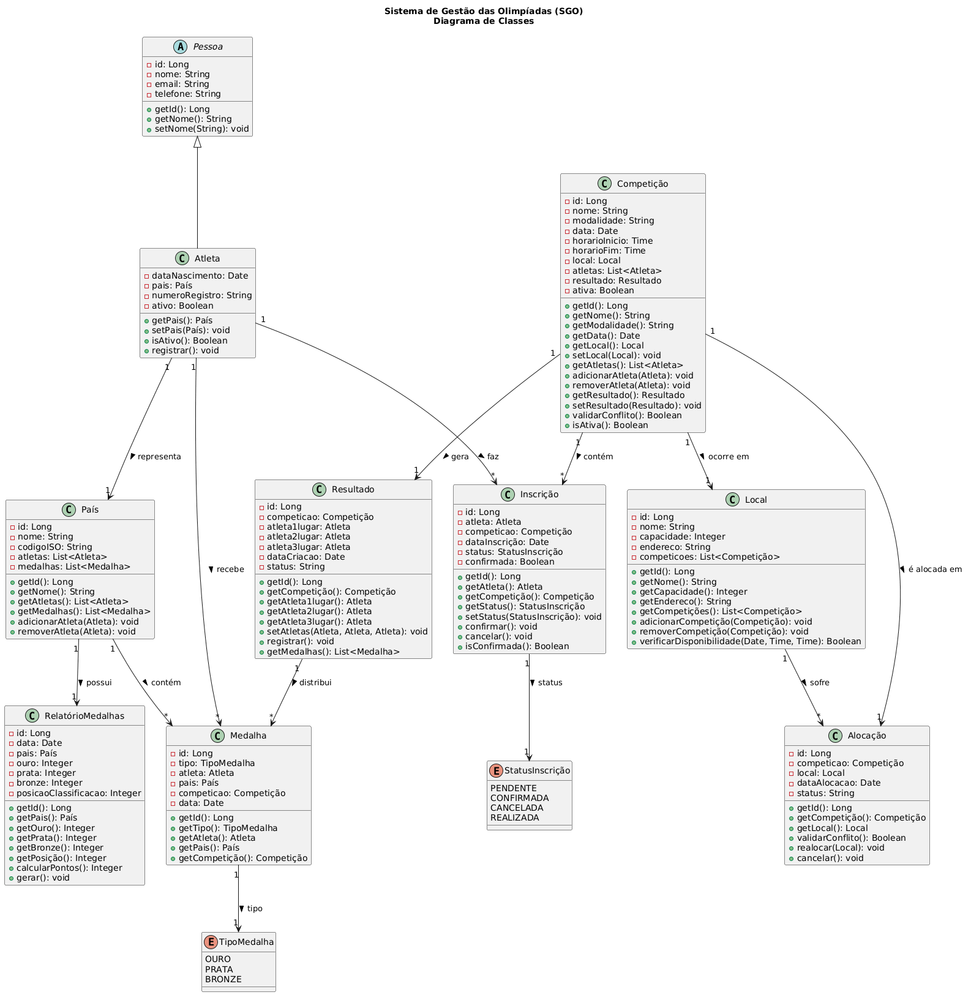
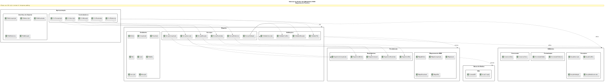
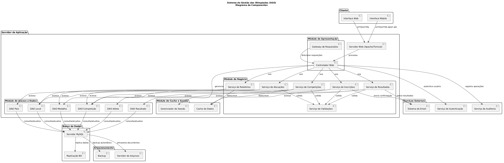
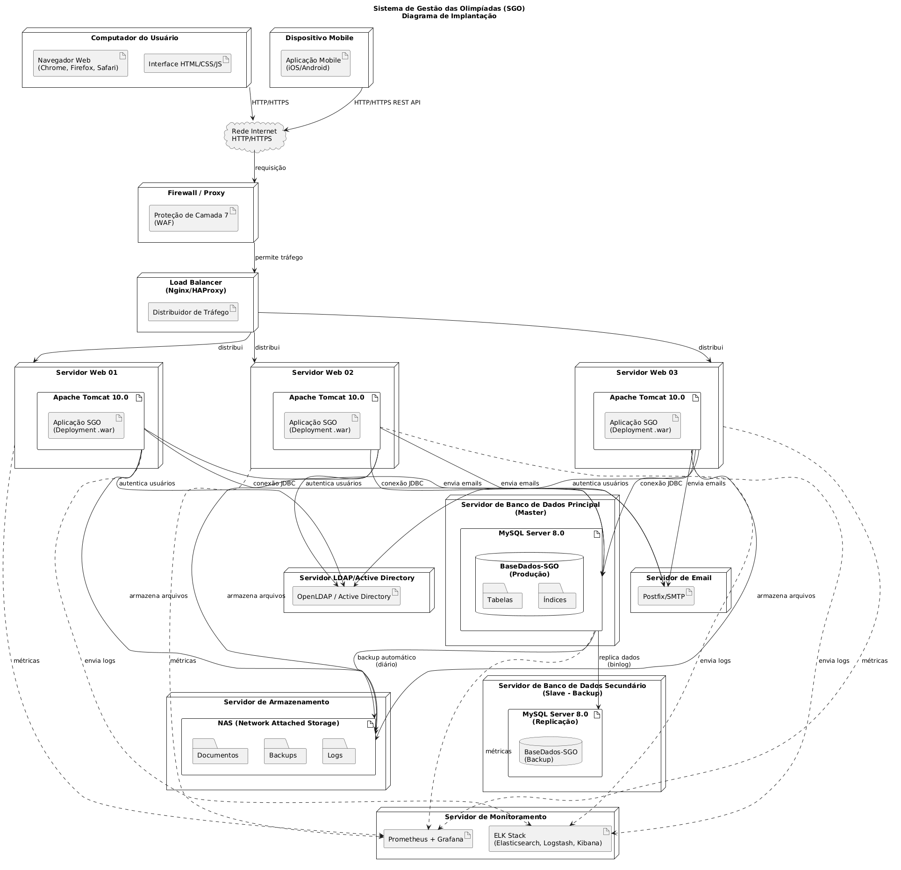

# Sistema de Gestão das Olimpíadas (SGO)

**Disciplina:** Projeto de Software  
**Professor:** João Paulo Carneiro Aramuni  
**Período:** 4º  
**Valor:** 10 pontos  
**Data de Entrega:** [Adicionar data]

---

## 📋 Índice

1. [Visão Geral](#visão-geral)
2. [Regras de Negócio](#regras-de-negócio)
3. [Histórias de Usuário](#histórias-de-usuário)
4. [Diagramas UML](#diagramas-uml)
5. [Estrutura do Projeto](#estrutura-do-projeto)
6. [Como Usar os Diagramas](#como-usar-os-diagramas)

---

## 🎯 Visão Geral

O **Sistema de Gestão das Olimpíadas (SGO)** é uma aplicação desenvolvida para coordenar os diferentes aspectos de um evento olímpico. O sistema permite:

- ✅ Gerenciamento de competições (cadastro, edição, exclusão)
- ✅ Inscrição de atletas em competições
- ✅ Alocação de locais sem conflitos de horário
- ✅ Registro de resultados (1º, 2º e 3º lugares)
- ✅ Geração de relatórios de medalhas por país

**Tecnologias Utilizadas:**
- Linguagem: Java
- Framework: Spring Boot / Jakarta EE
- Banco de Dados: MySQL 8.0
- Frontend: JSP/JSF ou React
- Arquitetura: MVC com padrões de design

---

## 📝 Regras de Negócio

### 1. Cadastro de Competições
O sistema deve permitir o cadastro de competições com os seguintes atributos:
- Nome da modalidade
- Data da competição
- Horário de início e término
- Local (alocação)
- Lista de atletas inscritos

**Restrições:**
- Não é permitido cadastrar competições com o mesmo nome
- Data não pode ser no passado
- Horário de fim deve ser posterior ao horário de início

### 2. Inscrição de Atletas
- Atletas de diferentes países podem se inscrever em competições
- Cada atleta pode participar de várias competições
- **Restrição Principal:** Um atleta só pode representar um país em cada modalidade
- Inscrições devem ser confirmadas antes da competição

### 3. Alocação de Locais
- Locais devem ser alocados para cada competição
- **Validação Crítica:** Evitar conflitos de horário
- Um local não pode abrigar duas competições simultaneamente
- Deve ser possível realocar competições em caso de necessidade

### 4. Controle de Resultados
- Resultados só podem ser registrados após a competição
- Sistema deve registrar:
  - 1º lugar (medalha de ouro)
  - 2º lugar (medalha de prata)
  - 3º lugar (medalha de bronze)
- Cada atleta vencedor corresponde a uma medalha para seu país

### 5. Relatórios de Medalhas
- Gerar ranking de países por número de medalhas
- Ordenar por:
  1. Medalhas de ouro (maior número primeiro)
  2. Medalhas de prata (desempate)
  3. Medalhas de bronze (segundo desempate)
- Consultar desempenho individual por país

---

## 👥 Histórias de Usuário

### **US01 - Cadastrar Competição**
```
Como: Administrador do Sistema
Desejo: Cadastrar uma nova competição
Para: Que a competição esteja disponível para inscrições de atletas

Critérios de Aceitação:
✓ Devo conseguir preencher nome da modalidade, data, horário e local
✓ O sistema deve validar se a data é válida (não no passado)
✓ Devo receber confirmação de cadastro com sucesso
✓ O sistema deve impedir duplicação de nomes de competições
```

### **US02 - Editar Competição**
```
Como: Gestor de Competições
Desejo: Editar informações de uma competição
Para: Corrigir ou atualizar detalhes da competição

Critérios de Aceitação:
✓ Devo poder alterar nome, data, horário e local
✓ Devo receber uma confirmação da edição
✓ Se a competição já tem inscritos, devo receber um aviso
✓ Não posso editar competições já finalizadas
```

### **US03 - Deletar Competição**
```
Como: Administrador
Desejo: Deletar uma competição
Para: Remover competições que não serão realizadas

Critérios de Aceitação:
✓ Devo poder selecionar uma competição e deletá-la
✓ O sistema deve avisar se há inscritos
✓ A deleção deve ser confirmada antes de ser executada
✓ Não posso deletar competições já finalizadas
```

### **US04 - Listar Competições**
```
Como: Qualquer Usuário
Desejo: Visualizar todas as competições
Para: Consultar informações das competições disponíveis

Critérios de Aceitação:
✓ Devo ver uma lista com todas as competições
✓ Cada competição deve mostrar: nome, data, horário e local
✓ Devo poder ordenar por data, nome ou local
✓ Devo poder filtrar por modalidade
✓ Devo poder pesquisar por nome
```

### **US05 - Inscrever Atleta em Competição**
```
Como: Atleta
Desejo: Me inscrever em uma competição
Para: Poder participar da competição

Critérios de Aceitação:
✓ Devo selecionar a competição desejada
✓ Devo confirmar meu país de origem
✓ O sistema deve validar se não sou repetido em outra modalidade
✓ Devo receber confirmação de inscrição
✓ Meu status deve aparecer como "PENDENTE" até confirmação
```

### **US06 - Confirmar Inscrição de Atleta**
```
Como: Gestor de Competições
Desejo: Confirmar inscrições de atletas
Para: Validar a participação dos atletas

Critérios de Aceitação:
✓ Devo ver uma lista de inscrições pendentes
✓ Devo poder confirmar ou rejeitar cada inscrição
✓ Status deve mudar para "CONFIRMADA" após confirmação
✓ O atleta deve receber uma notificação
```

### **US07 - Cancelar Inscrição**
```
Como: Atleta ou Administrador
Desejo: Cancelar minha inscrição em uma competição
Para: Desistir de participar da competição

Critérios de Aceitação:
✓ Devo poder cancelar apenas inscrições "PENDENTES" ou "CONFIRMADAS"
✓ Não posso cancelar se a competição já iniciou
✓ Status deve mudar para "CANCELADA"
✓ Uma notificação deve ser enviada
```

### **US08 - Validar País do Atleta**
```
Como: Sistema
Desejo: Validar se o atleta já está registrado em outro país
Para: Garantir que um atleta representa apenas um país por modalidade

Critérios de Aceitação:
✓ O sistema deve verificar inscrições anteriores do atleta
✓ Se já está registrado em outra modalidade com outro país, rejeitar
✓ Se está registrado na mesma modalidade com outro país, rejeitar
✓ Deve retornar mensagem clara do motivo da rejeição
```

### **US09 - Alocar Local para Competição**
```
Como: Gestor de Alocação
Desejo: Alocar um local para uma competição
Para: Definir onde a competição será realizada

Critérios de Aceitação:
✓ Devo selecionar uma competição e um local
✓ O sistema deve validar conflito de horário
✓ Se houver conflito, devo receber aviso e sugestões de alternativas
✓ Devo receber confirmação da alocação com sucesso
✓ A alocação deve ser registrada com data/hora
```

### **US10 - Validar Conflito de Horário**
```
Como: Sistema
Desejo: Validar se há conflito de horário para um local
Para: Garantir que um local não tenha duas competições simultaneamente

Critérios de Aceitação:
✓ Devo verificar todas as competições alocadas ao local
✓ Devo comparar intervalos de horário
✓ Se houver sobreposição, retornar erro
✓ Devo sugerir horários/locais alternativos disponíveis
```

### **US11 - Realocar Local de Competição**
```
Como: Gestor de Alocação
Desejo: Mudar o local de uma competição
Para: Resolver conflitos ou otimizar o uso de espaços

Critérios de Aceitação:
✓ Devo poder selecionar uma nova local
✓ O sistema deve validar se não há conflito no novo local
✓ Um histórico de realocações deve ser mantido
✓ Notificações devem ser enviadas aos atletas
✓ Não posso realocar competições já finalizadas
```

### **US12 - Registrar Resultados**
```
Como: Árbitro ou Juiz
Desejo: Registrar os resultados de uma competição
Para: Determinar as medalhas (ouro, prata, bronze)

Critérios de Aceitação:
✓ Devo selecionar a competição finalizada
✓ Devo inserir o atleta campeão (1º lugar)
✓ Devo inserir o segundo colocado (2º lugar)
✓ Devo inserir o terceiro colocado (3º lugar)
✓ Os dados devem ser validados (não podem ser repetidos)
✓ Status da competição deve mudar para "FINALIZADA"
```

### **US13 - Registrar Posições (1º, 2º, 3º)**
```
Como: Sistema
Desejo: Atualizar o resultado com as posições
Para: Registrar corretamente os colocados

Critérios de Aceitação:
✓ 1º lugar = medalha de ouro para o país do atleta
✓ 2º lugar = medalha de prata para o país do atleta
✓ 3º lugar = medalha de bronze para o país do atleta
✓ Cada medalha deve ser registrada com data e competição
✓ Deve ser possível editar as posições até a competição não estar finalizada
```

### **US14 - Determinar Medalhas**
```
Como: Sistema
Desejo: Registrar automaticamente as medalhas
Para: Manter o registro atualizado de medalhas por país

Critérios de Aceitação:
✓ Ao registrar resultado, medalhas devem ser criadas automaticamente
✓ Cada medalha deve ter tipo (ouro, prata, bronze)
✓ Cada medalha deve estar associada ao país do atleta
✓ O país deve ter seu saldo de medalhas atualizado
✓ Histórico de medalhas deve ser mantido
```

### **US15 - Gerar Relatório de Medalhas**
```
Como: Administrador ou Consultor
Desejo: Gerar um relatório de medalhas por país
Para: Acompanhar o desempenho das nações

Critérios de Aceitação:
✓ Devo poder gerar o relatório em qualquer momento
✓ Relatório deve mostrar países ordenados por:
  1. Total de ouro (maior para menor)
  2. Total de prata (desempate)
  3. Total de bronze (segundo desempate)
✓ Devo poder exportar em PDF ou CSV
✓ Relatório deve incluir data de geração
✓ Devo poder filtrar por período de competições
```

### **US16 - Consultar Desempenho por País**
```
Como: Usuário
Desejo: Consultar o desempenho de um país específico
Para: Acompanhar suas medalhas

Critérios de Aceitação:
✓ Devo selecionar um país da lista
✓ Devo ver total de medalhas (ouro, prata, bronze)
✓ Devo ver lista de atletas que ganharam medalhas
✓ Devo ver as competições em que participou
✓ Devo poder visualizar histórico completo
```

### **US17 - Gerar Classificação Geral**
```
Como: Administrador
Desejo: Gerar uma classificação geral das olimpíadas
Para: Divulgar o ranking final de países

Critérios de Aceitação:
✓ Devo poder gerar quando as olimpíadas terminam
✓ Classificação deve incluir todos os países participantes
✓ Devo ver ranking por medalhas (ouro, prata, bronze)
✓ Devo ver pontos totais (se aplicável)
✓ Devo poder exportar em múltiplos formatos
✓ Devo poder imprimir o relatório
```

---

## 📊 Diagramas UML

### 1. Diagrama de Caso de Uso


**Descrição:** Apresenta todos os atores (Administrador, Gestor, Árbitro, Atleta) e seus principais cenários de interação com o sistema.

---

### 2. Diagrama de Classes


**Descrição:** Mostra a estrutura estática com entidades (Atleta, Competição, Local, Resultado, Medalha, País) e seus relacionamentos.

---

### 3. Diagrama de Pacotes


**Descrição:** Organiza o sistema em 5 camadas: Apresentação, Negócio, Persistência, Banco de Dados e Utilitários.

---

### 4. Diagrama de Componentes


**Descrição:** Mostra os módulos do sistema (Interface, Serviços, DAOs, Cache) e como se comunicam entre si.

---

### 5. Diagrama de Implantação


**Descrição:** Ilustra a arquitetura física com clientes, servidores, banco de dados, cache e serviços externos.

---

## 📁 Estrutura do Projeto

```
projeto-sgo/
├── README.md
├── imagens/
│   ├── diagrama-de-caso-de-uso.png
│   ├── diagrama-de-classes.png
│   ├── diagrama-de-pacotes.png
│   ├── diagrama-de-componentes.png
│   └── diagrama-de-implantacao.png
└── codigos/
    ├── diagrama-de-caso-de-uso.puml
    ├── diagrama-de-classes.puml
    ├── diagrama-de-pacotes.puml
    ├── diagrama-de-componentes.puml
    └── diagrama-de-implantacao.puml
```

---

## 🔧 Como Usar os Diagramas

### Gerando Imagens do PlantUML Online
1. Acesse: https://www.plantuml.com/plantuml/uml/
2. Copie o conteúdo de um arquivo `.puml`
3. Cole no editor
4. Clique em "Download as PNG"

---

## 📞 Referências

- PlantUML: https://plantuml.com/
- UML Specification: https://www.omg.org/spec/UML/

---

**Status:** ✅ Pronto para entrega
